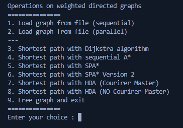

# A-Star Project

## Introduction
A* is a widely used pathfinding algorithm for traversing Graphs; it extends Dijkstra's algorithm by introducing the concept of **Heuristic Function** which plays a key role in making more optimal decisions at each step.

In this project we developed several versions of this algorithm, both **sequential** and **parallel** ones, with the goal of testing one against the other and getting a final result that summarises their overall performances.

## Compilation Guide
The code can be compiled by means of a single **Makefile** in four different ways:

1. **make**: Standard compilation that produces an executable named **AStar** useful for executing the different versions of the algorithm and visualizing the paths computed by the latter.  

2. **make debug**: Produces an executable file named **AStar_debug** optimal for debugging purposes as during execution it will print on screen the most important steps performed by the algorithm.

3. **make time**: Produces an executable file named **AStar_time** very similar to **AStar** one; in addition to the latter it also shows the total time of execution of the different versions of the algorithm.

4. **make test**: Will produce an executable named **Test** used to compare one another completion times, correctness and several other benchmarks resulting from the execution of all the implementations of A*.

## Execution Guide
When executed, **AStar**, **AStar_debug** and **AStar_time**, will show the same menu shown in the picture below.

### Graph Loading
At first it will be neccessary to load a Graph into memory; this is made possible by **options 1 and 2** that will ask for the **.bin** file to be loaded and also if we want to start the **numbering of nodes from 0 or 1**. In addition **option 2** will also ask for the number of threads that are to be used for the load of the graph.

### Graph .bin Files format
In order for a .bin file to be used for the representation of a graph, it has to follow specific format rules defined by us:

- **First row** must be an **integer N** that specifies the total amount of nodes of the graph

- The following **N rows** have to define the **cordinates of each node in this way**:
    + one **float** for the first cordinate .
    + one **float** for the second cordinate.

-  Succeeding the list of nodes, it has to be represented the **list of edges** that will reach until the end of the file; **edges must be represented in the following way**:

    + one **int** for the precursor of the edge
    + one **int** for the successor of the edge
    + one **float** for the weight of the edge

### Execution of a version of A*
Once a Graph has been loaded it will be possible to choose among one of the A* versions to be executed (from **option 3 to option 7**); each version will require some specific settings to be chosen by the user prior to the execution of the algorithm.

### Settings of A* implementation
The available settings introduced above will be now described thoroughly:

- **Start** and **End** nodes: respectively the nodes for which a path has to be searched.

- **Number of threads**: parameter required only for the concurrent implementations of A* (**options from 4 to 7**), it defines the number of threads to be used for the path traversing.

- **Type of search**: this parameter defines the type of search that will be performed by the algorithm inside the builtin **priority queue**.
    
    + **LINEAR SEARCH**: available in all versions, performs a single-threaded search in O(n)
    + **CONSTANT SEARCH** available in all versions, performs a search in O(1) but it requires an additional in-memory data structure.  

    + **PARALLEL SEARCH**: available only in sequential versions of the algorithm (**option 3**) performs a multi-threaded search, the amount of threads generated will be the same as the amount of cores available in the machine.

- **Heuristic Function**: defines the function to be used in order to compute the distance from a generic node to the destination.

    + **Dijkstra emulator**: Simulates **Dijkstra** shortest path algorithm behaviour which doesn't take into account any Heuristic Function, hence it always **returns 0**.

    + **Euclidean Distance**: Computes the **Euclidean Distance** between two points on a plane (optimal when using **Cartesian cordinates**).

    + **Haversine Distance**: Computes the angular distance between two points on a sphere (optimal when using **Geographic cordinates**).

- **Hash Function**: choosing an hash function is required when executing the two **HDA versions** of A* (**options 6 and 7**); each of them will be explained in detail in the project documentation.

    + **Random Hash**

    + **Multiplicative Hash**

    + **Zobrist Hash**

    + **Abstract (State) Zobrist Hash**

    + **Abstract (Feature) Zobsrist Hash**

